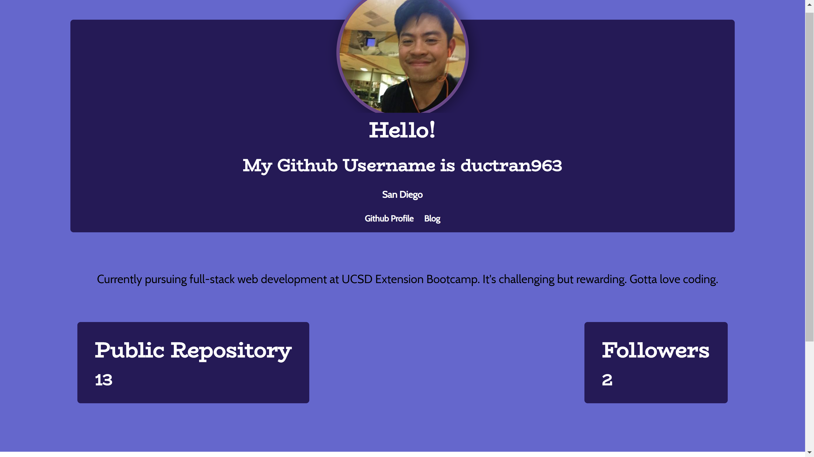

# Developer Profile Generator

#### Purpose

The purpose of this project is to learn to make API call and to manipulate node.js so that we can run all of our javascript without using browser. We also learn to use template literal as well as converting html to css.

#### Functionality

The functionality is to create a developer profile so that we can track github users progress, their followers, their followings as well as their repos and updated profile.

#### Link to github page: 
https://ductran963.github.io/DevProfileGenerator/

#### Developer Profile HTML image:

#### Developer Profile PDF image:

